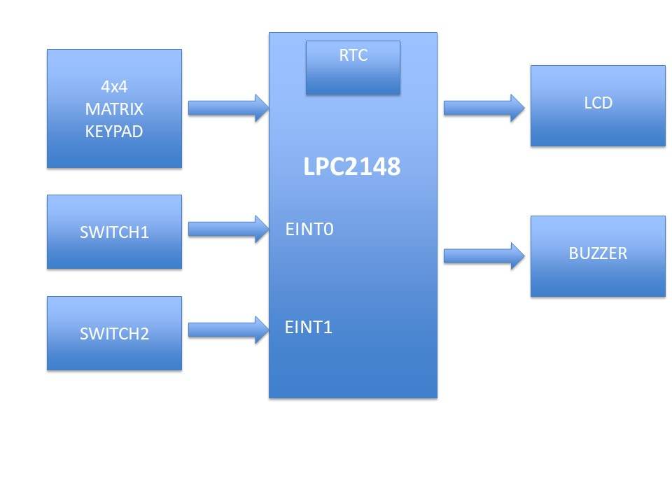
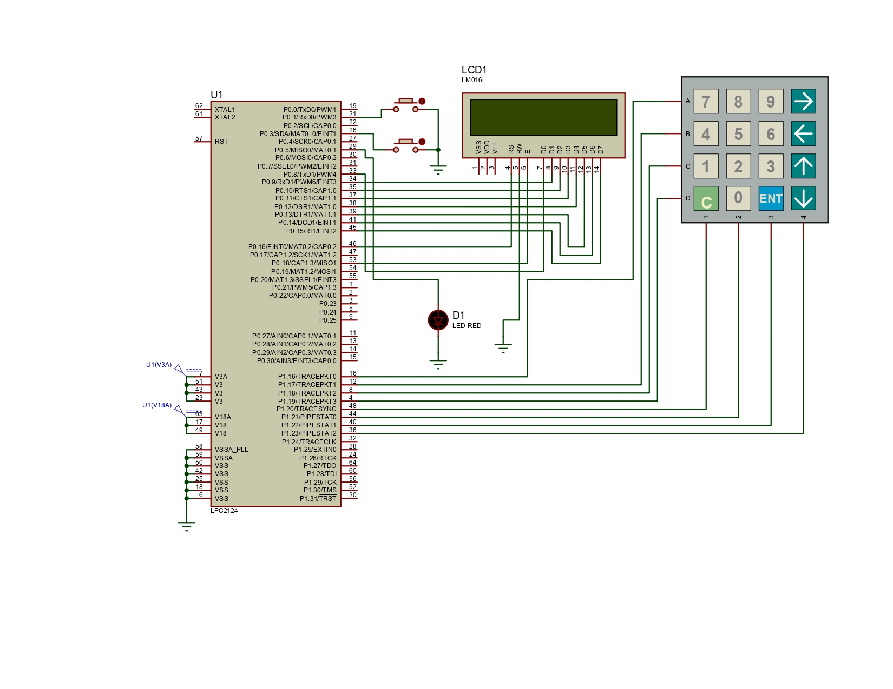
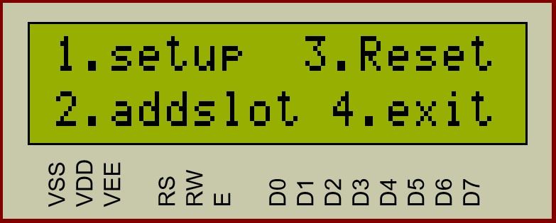
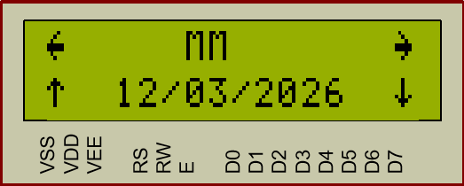
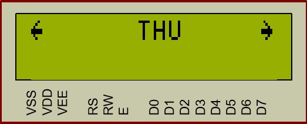
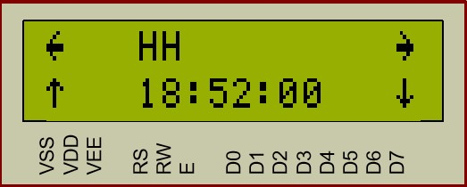
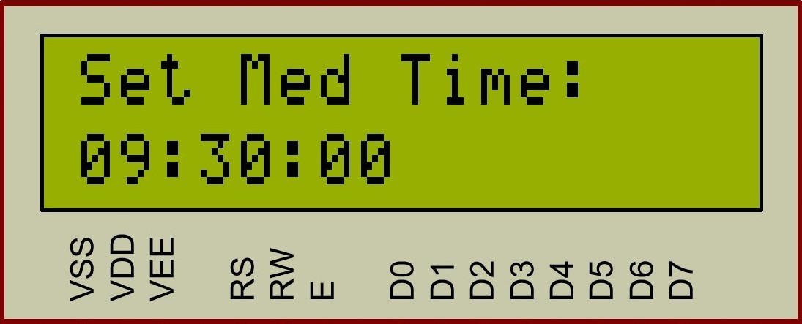
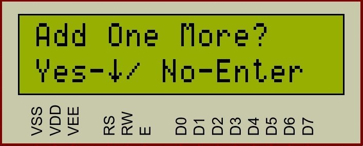
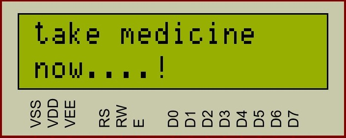

<<<<<<< HEAD
# Medicine Reminder System

This project is an embedded system developed using the **LPC2148 ARM7 microcontroller**.  
It reminds users to take medicine at scheduled times using an **LCD display and buzzer alert**.

## Features

- Real Time Clock (RTC) based reminder
- User configurable date and time
- Add up to 5 medicine reminder slots
- LCD display for menu and alerts
- Keypad based user input
- Buzzer alert when medicine time occurs

## Hardware Used

- LPC2148 Microcontroller
- 16x2 LCD
- 4x4 Keypad
- Buzzer
- Interrupt Switches

## How It Works

1. User presses the setup switch to enter the configuration menu.
2. User sets the **date, day, and time** using the keypad.
3. User adds medicine reminder time slots.
4. The system continuously checks RTC time.
5. When the time matches a stored slot, the system generates an alert.
6. The user presses the acknowledge switch to stop the alert.

---

## Project Images

### Block Diagram

This diagram shows how the **LPC2148 microcontroller is connected with the LCD, keypad, buzzer, and interrupt switches** used in the system.

---

### Circuit Schematic

This schematic shows the **complete hardware connections of the mini project**, including the LPC2148 microcontroller, LCD, keypad interface, RTC configuration, and buzzer circuit.

---

### Demo

[▶ Watch Demo](Demo.mp4)

This video demonstrates the **working of the Medicine Reminder System**, including menu navigation, time configuration, adding medicine slots, and buzzer alert when the scheduled time occurs.

---

### Menu Display

This screen shows the **main configuration menu displayed on the LCD** when the user enters setup mode.

---

### Date Edit Screen

This interface allows the user to **edit the date fields such as DD (date), MM (month), and YYYY (year)**.

---

### Day Selection

This screen allows the user to **select the current day of the week** for the RTC configuration.

---

### Time Edit Screen

This screen allows the user to **modify the time values such as hours, minutes, and seconds**.

---

### Add Medicine Slot

This interface allows the user to **add a medicine reminder time slot**. The system supports up to **five reminder slots**.

---

### Add Another Slot

After adding a reminder slot, the system asks the user **whether to add another slot or exit the configuration**.

---

### Medicine Alert

When the **RTC time matches a configured medicine slot**, the system displays a **“Take Medicine Now” message and activates the buzzer**.

---

## Author

J Bhargava Satish
=======
# USER-CONFIGURABLE-MEDICINE-REMINDER-SYSTEM
>>>>>>> f5e14afeaf24043496980f8b4265dfe43b026b3f
